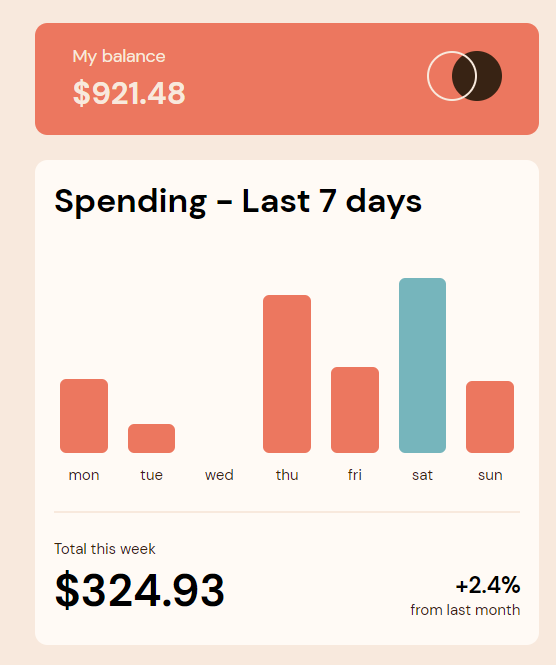
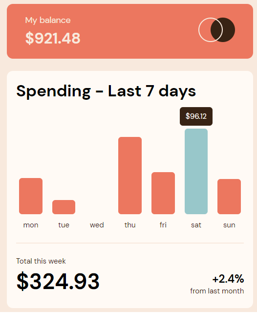

# Frontend Mentor - Expenses chart component solution

This is a solution to the [Expenses chart component challenge on Frontend Mentor](https://www.frontendmentor.io/challenges/expenses-chart-component-e7yJBUdjwt). Frontend Mentor challenges help you improve your coding skills by building realistic projects. 

## Table of contents

- [Overview](#overview)
  - [The challenge](#the-challenge)
  - [Screenshot](#screenshot)
  - [Links](#links)
- [My process](#my-process)
  - [Built with](#built-with)
  - [What I learned](#what-i-learned)
  - [Continued development](#continued-development)
- [Author](#author)

**Note: Delete this note and update the table of contents based on what sections you keep.**

## Overview

### The challenge

Users should be able to:

- View the bar chart and hover over the individual bars to see the correct amounts for each day
- See the highest expense day’s bar highlighted in a different colour to the other bars
- View the optimal layout for the content depending on their device’s screen size
- See hover states for all interactive elements on the page
- **Bonus**: Use the JSON data file provided to dynamically size the bars on the chart

### Screenshot





### Links

- Solution URL: https://github.com/tarikochuery/expenses-chart-component-main
- Live Site URL: https://chart-expenses.herokuapp.com/

## My process

### Built with

- Semantic HTML5 markup
- CSS custom properties
- Flexbox
- Vanilla Js

### What I learned

In the CSS style sheet I learned how to style geometric forms to decor the component. The circles at the component's header are not an image, but a CSS built figure. Teh code is shown below:

```css
.circle {
  height: 40px;
  width: 40px;
  border-radius: 50%;
  border: 2px solid var(--cream);
  display: inline-block;
}

.full-circle {
  background-color: var(--dark-brown);
  border: none;
}

.empty-circle {
 right: -25px;
 position: relative;
}
```

For JavaScript school day, I learned a new way to add elements in an array or object using spread function:

```js
const setBarsColors = (data) => {
  let barsData = []
  const { day: higherDayExpense } = getHigherDayExpense()


  data.forEach(dayExpense => {
    const { day } = dayExpense

    if (day === higherDayExpense){
      dayExpense = {...dayExpense, color: 'var(--cyan)'}
    } else {
      dayExpense = {...dayExpense, color: 'var(--soft-red)'}    
    }

    barsData = [...barsData, dayExpense]
  })

  return barsData
}
```

I find easier to add a new element/property this way, than the Array methods, because it's easier to understand what's going on in the code.

### Continued development

For the next projects I look forward to work on improving my typescripts abilities, and built components with React.js.


## Author

- LinkedIn - [Tarik Chuery](https://www.linkedin.com/in/tarik-chuery/)
- Frontend Mentor - [@tarikochuery](https://www.frontendmentor.io/profile/tarikochuery)
